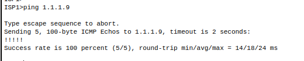
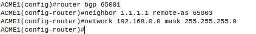
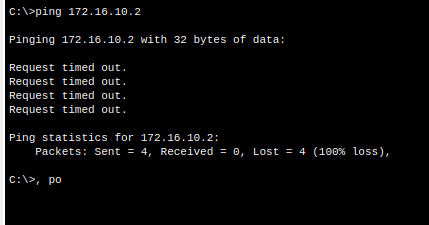
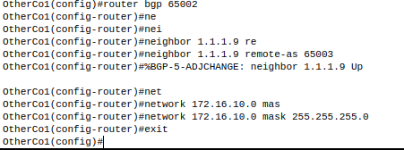
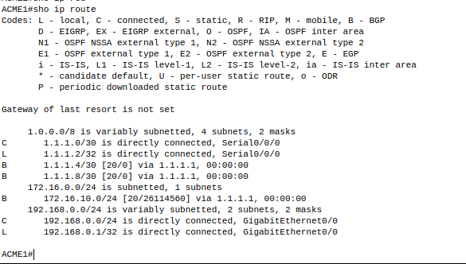
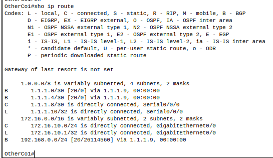
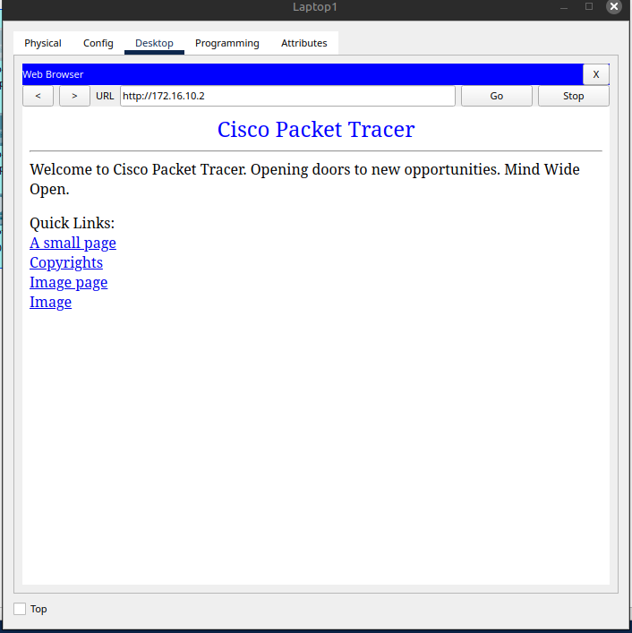
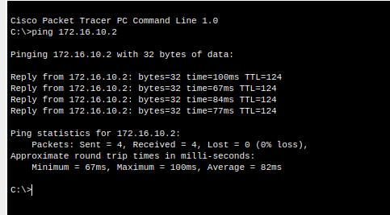

# BGP activity

Primeramente se aclara que no se van a hacer configuraciones de interfaces porque el ejercicio ya las trae configuradas, solamente se configura el BGP (Border Gateway Protcol)

## Step 1

Se ponen imagenes evidenciando los puntos cumplidos

a) Verify that the ISP has provided IP reachability through its network by pinging 1.1.1.9, the IP address assigned to ISP2’s Serial 0/0/0.

b) From any device inside ACME’s network, ping the Other Company’s server 172.16.10.2. The pings should fail as no BGP routing is configured at this time. 

c) Configure ACME1 to become an eBGP peer with ISP1. ACME’s AS number is 65001, while the ISP is using AS number 65003. Use the 1.1.1.1 as the neighbor IP address and make sure to add ACME’s internal network 192.168.0.0/24 to BGP.

From any device inside ACME’s network, ping the Other Company internal server again. Does it work? Esto no funciona porque aún no se ha configurado el BGP en el otro lado (en la otra AS), por lo que aún no se pueden comunicar los dispositivos en ACME1 con Other Company Internal Server. Se adjunta imágen mostrando esto.

Configure eBGP in Other Company Inc. Se adjunta imagen mostrando configuraciones.

## Step 2

a) Verify that ACME1 has properly formed an eBGP adjacency with ISP1. The show ip bgp summary command is very useful here.

Se muestra como se tiene adyancencia con el ISP1 desde ACME1

b) Use the show ip bgp summary command to verify all the routes ACME1 has learned via eBGP and their status. *** Ver la imagen anterior ***.

c) Look at the routing tables on ACME1 and OtherCo1. ACME1 should have routes learned about Other Company’s route 172.16.10.0/24. Similarly, OtherCo1 should now know about ACME’s route 192.168.0.0/24.

Como se puede observar se cumple que ambos aprendieron las rutas de cada uno, ACME tiene la ruta hacia Other (172.16.10.0/24) y OtherComp tiene la ruta hacia ACME (192.168.0.0/24)

d) Open a web browser in any ACME Inc. end devices and navigate to Other Company’s server by entering its IP address 172.16.10.2. Esto es equivalente a hacer ping porque significa que hay conexion con el OtherComp router y server.

e) From any ACME Inc. device, ping the Other Company’s server at 172.16.10.2.

