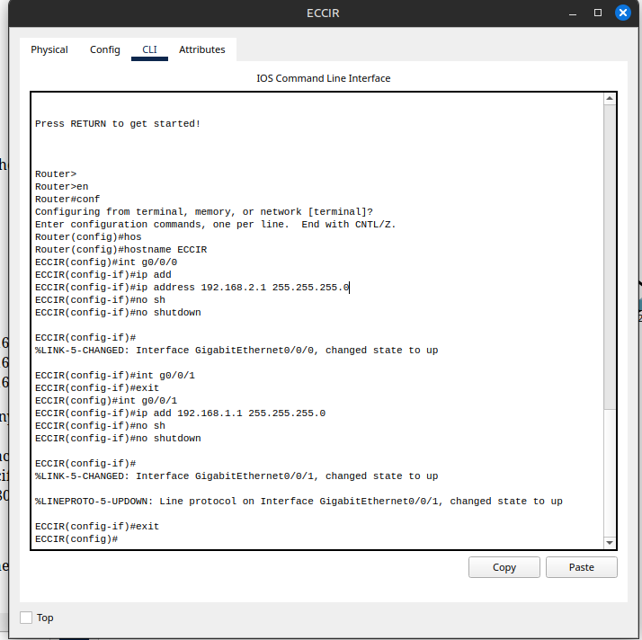
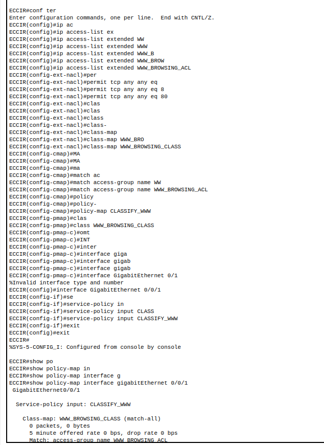
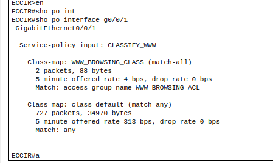
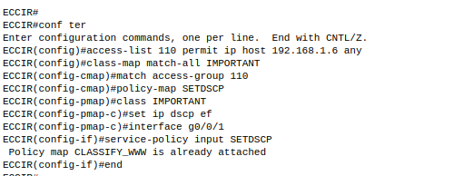
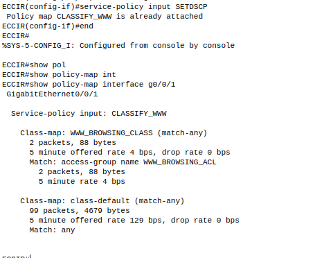
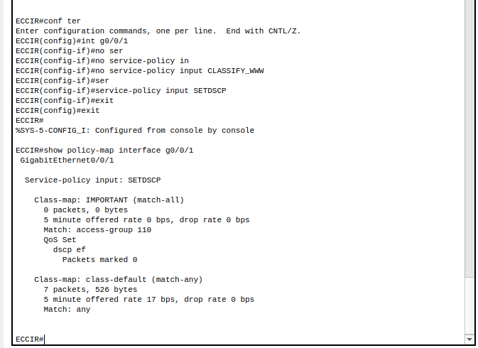
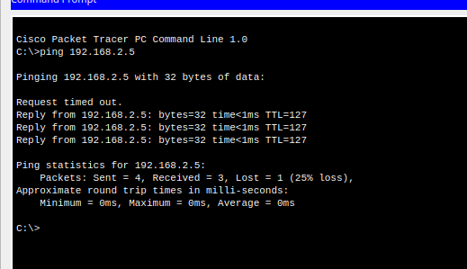
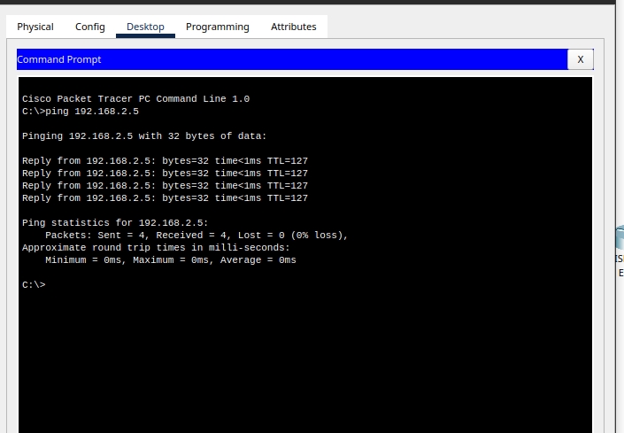
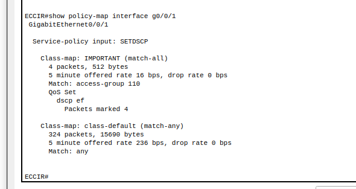

# QoS Actividad

## Imagenes del proceso

En este caso como el proceso es tan guiado solo se adjuntaran imagenes como evidencia y algunas preguntas dentro del pka

No se pondran imagenes de las PC, ya que estas se pueden consultar en el archivo .pka

Configuration to classify the Traffic

Analyze the output of this command. How many packets show up in www class? Viendo la imagen anterior, se ve que hay 0 paquetes en la www class

Analyze the output of this command. How many packets show up in www class? Viendo la imagen anterior, luego de generar el trafico tal como se indica en las instrucciones, hay dos paquetes en la clase www.

Se aplica la nueva politica, NOTA: aca se tiene que quitar la politica anterior para poder visualizar esta, no esta en las instrucciones, sin embargo se debe de hacer, a este punto ya el .pka esta al 100% completado.

Note que luego de hacer toda la configuracion en la imagen de abajo se puede que la politica no cambia

Se aplican las nuevas politicas:

Note que ya se puede visualizar la nueva politica tal como se pide en la actividad

Analyze the output of this command. How many packets are marked with dscp ef? Notese en la imagen anterior que el numero de paquetes marcados es 0.

Ahora se hara ping de la PC1 a PC3

Did the number of packets marked "ef" increase? Adelantando la respuesta, no, no se aumenta, ya que esta politica esta puesta sobre 192.168.1.6, es decir la PC2, no afecta lo que haga laPC1 mientras no sea comunicacion con la PC2, es decir de la PC2 a la PC1 si deberian de aumentar los paquetes, la prueba se hara de la PC2 a la PC3

Ahora se vuelve a analizar la salida del comando anteriormente comentado:

No se pone imagen de la salida, ya que fue igual a la de la primera imagen que dice que hay que analizarla (la primera imagen de la nueva politica, ignorar la de WWW_BROWSING_CLASS, aca se habla de SETDSCP)

Ahora se hace ping de la PC2 a la PC3

Now from PC2, ping PC3. Now run the command show policy-map interface g0/0/1.
Did the number of packets marked "ef" increase? Si, los paquetes se incrementaron, ahora son 4 paquetes marcados, que fueron la misma cantidad que se envio a la PC3.

SE DEBEN ENCENDER LOS PUERTOS DE LAS PC para que todo funcione correctamente.

