# TCP y UDP actividad

## Part I

### Step I

a. Click MultiServer and click the Desktop tab > Command Prompt.

b. Enter the ping -n 1 192.168.1.255 command. You are pinging the broadcast address for the client LAN. The command option will send only one ping request rather than the usual four. This will take a few seconds as every device on the network responds to the ping request from MultiServer.

c. Close the MultiServer window.

Se adjunta imagen que abarca estos pasos.

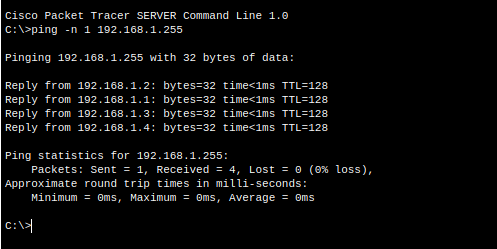

### Step II

a. Switch to Simulation mode.

b. Click HTTP Client and open the Web Browser from the desktop.

c. In the URL field, enter 192.168.1.254 and click Go. Envelopes (PDUs) will appear in the topology window.

d. Minimize, but do not close, the HTTP Client configuration window.

Se adjunta imagen que abarca todos estos pasos.

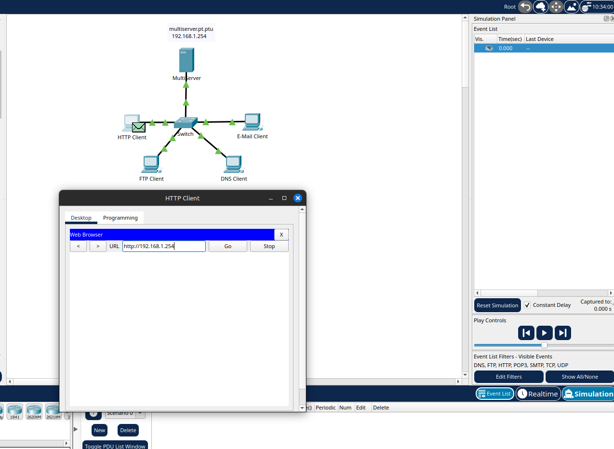

### Step III

a. Click FTP Client and open the Command Prompt from the desktop

b. Enter the ftp 192.168.1.254 command. PDUs will appear in the simulation window.

c. Minimize, but do not close, the FTP Client configuration window.

Se adjunta imagen que abarca todos estos pasos.

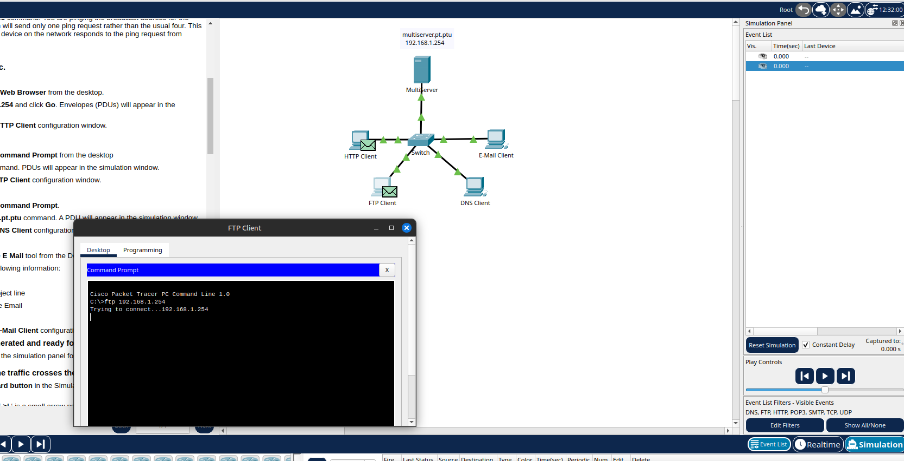

### Step IV

a. Click DNS Client and open the Command Prompt.

b. Enter the nslookup multiserver.pt.ptu command. A PDU will appear in the simulation window.

c. Minimize, but do not close, the DNS Client configuration window.

Se adjunta imagen que abarca todos estos pasos.

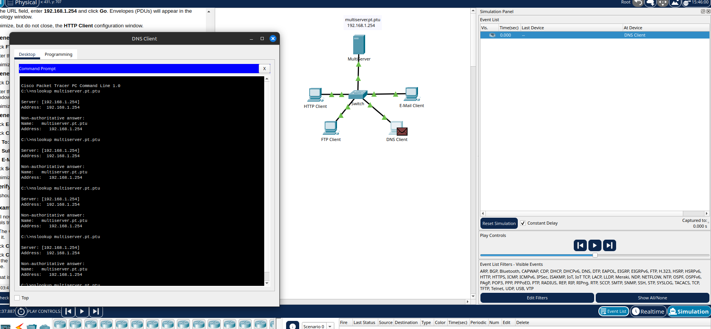

### Step V

a. Click E-Mail Client and open the E Mail tool from the Desktop.

b. Click Compose and enter the following information:

    1) To: user@multiserver.pt.ptu

    2) Subject: personalize the subject line

    3) E-Mail Body: personalize the Email

c. Click Send.

d. Minimize, but do not close, the E-Mail Client configuration window.

Imagenes que abarcan este paso:

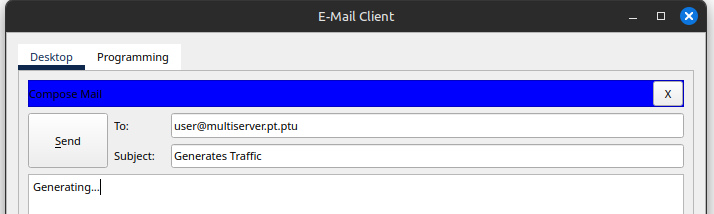

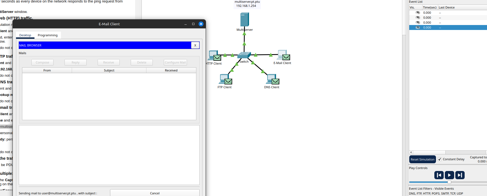

### Step VI

There should now be PDU entries in the simulation panel for each of the client computers.

Ver fotos anteriores

### Step VII

a.     Click Capture/Forward once. All of the PDUs travel to the switch.

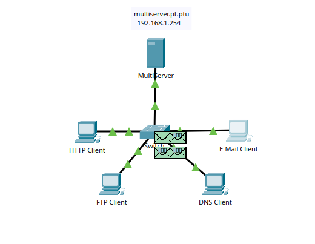

b.     Click Capture/Forward six times and watch the PDUs from the different hosts as they travel on the network. Note that only one PDU can cross a wire in each direction at any given time.

What is this called?

conversation multiplexing

A variety of PDUs appears in the event list in the Simulation Panel. What is the meaning of the different colors?

Representan los diferentes protocolos que se usan en esta simulacion

Se adjunta imagen como evidencia que se corrio la simulacion.

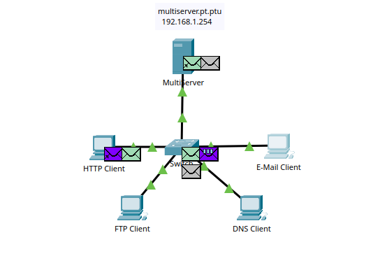

## Part II

### Step I

a. Click Reset Simulation.

b. Filter the traffic that is currently displayed to only HTTP and TCP PDUs. To filter the traffic that is currently displayed:

    1) Click Edit Filters and toggle the Show All/None button.

    2) Select HTTP and TCP. Click the red “x” in the upper right-hand corner of the Edit Filters box to close it. Visible Events should now display only HTTP and TCP PDUs.

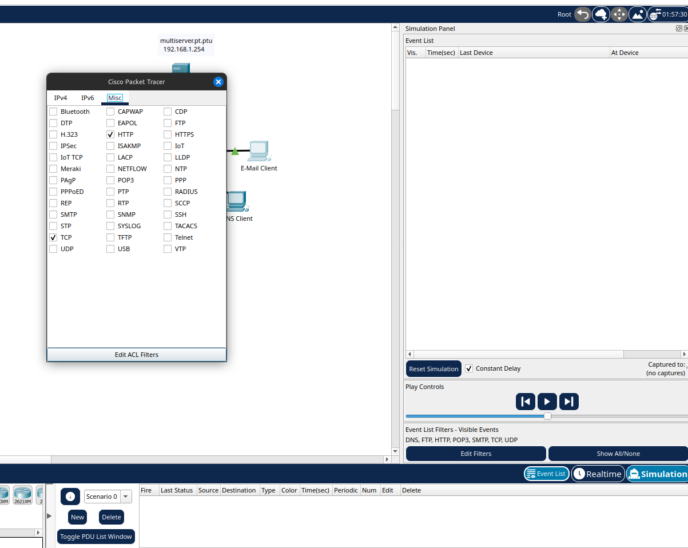

c. Open the browser on HTTP Client and enter 192.168.1.254 in the URL field. Click Go to connect to the server over HTTP. Minimize the HTTP Client window.

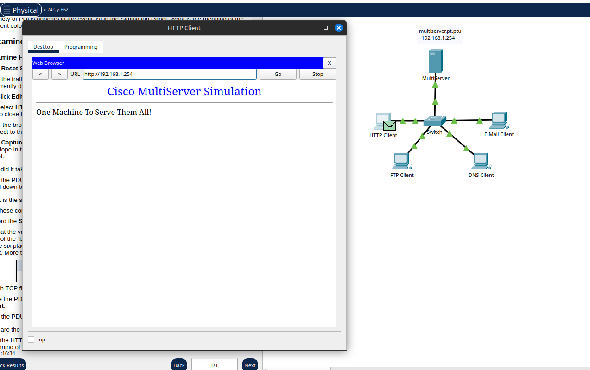

d. Click Capture/Forward until you see a PDU appear for HTTP. Note that the color of the envelope in the topology window matches the color code for the HTTP PDU in the Simulation Panel.

Se tocaron los botones hasta que aparecio el PDU HTTP en este caso morado

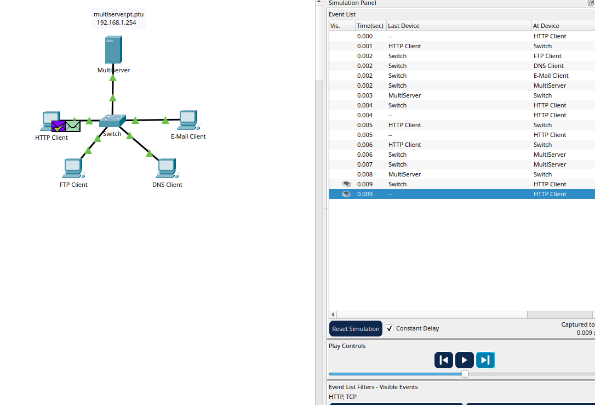

Question:
Why did it take so long for the HTTP PDU to appear?

Porque TCP debe establecer primero la conexión para que pueda comenzar el tráfico HTTP.

e. Click the PDU envelope to show the PDU details. Click the Outbound PDU Details tab and scroll down to the second to the last section.

Para contestar estas preguntas se hace uso de la siguiente imagen:

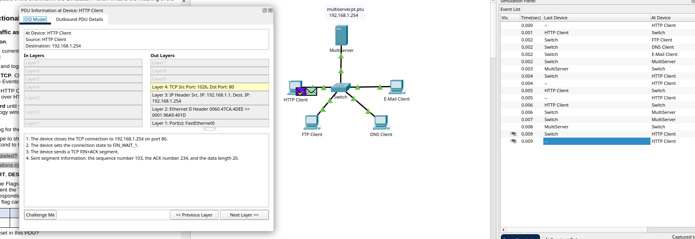

Questions:
What is the section labeled?

Es TCP capa 4

Are these communications considered to be reliable?

Por supuesto porque TCP se usa, si fuera UDP no se consideran confiables.

Record the SRC PORT, DEST PORT, SEQUENCE NUM, and ACK NUM values.

1026 (puede variar este valor), 80, 1, 1

Puede ver esta imagen del parquete para corroborar la informacion

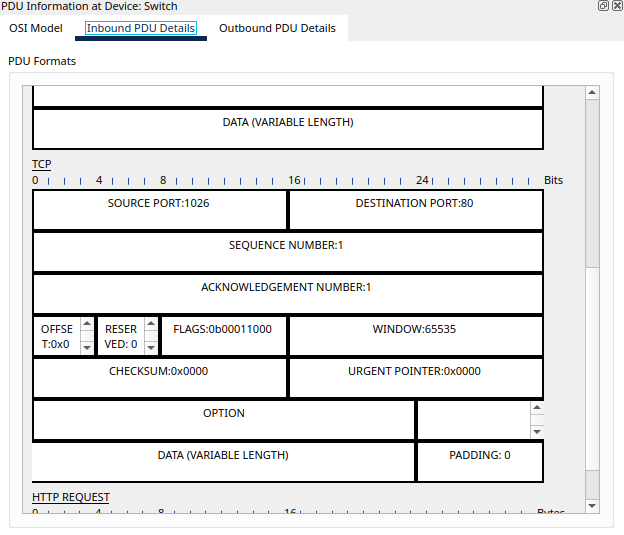

f. Look at the value in the Flags field, which is located next to the Window field. The values to the right of the “b” represent the TCP flags that are set for this stage of the data conversation. Each of the six places corresponds to a flag. The presence of a “1” in any place indicates that the flag is set. More than one flag can be set at a time. The values for the flags are shown below.

| Flag place | 6 | 5 | 4 | 3 | 2 | 1 |
|------|------|------|------|------|------|------|
| Value | URG | ACK | PSH | RST | SYN | FIN |

Which TCP flags are set in this PDU?

ACK y PSH

g. Close the PDU and click Capture/Forward until a PDU with a checkmark returns to the HTTP Client.

h. Click the PDU envelope and select Inbound PDU Details.

Para contestar esta pregunta se toma la siguiente imagen de referencia:

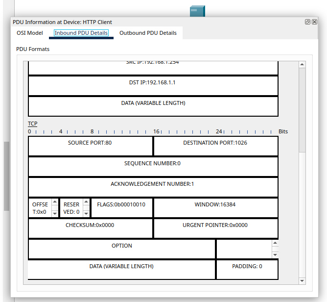

Question:
How are the port and sequence numbers different than before?

Los puertos de origen y destino, en este caso estan invertidos, y el ack es 1, cambia el numero de secuencia.
Las banderas en este caso son SYN y ACK.

i. Click the HTTP PDU which HTTP Client has prepared to send to MultiServer. This is the beginning of the HTTP communication. Click this second PDU envelope and select Outbound PDU Details.

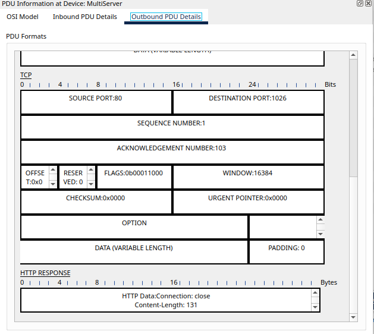

Question:
What information is now listed in the TCP section? How are the port and sequence numbers different from the previous two PDUs?

Los pueros vuelven a estar invertidos, el numero de secuencia es 1 pero el ack cambia a 103 en mi caso, creo que este valor puede variar.

j. Reset the simulation.

### Step II

Nota: ya no se van a poner imagenes obvias, como los filtros, ya que estas se pueden omitir.

a. Open the command prompt on the FTP Client desktop. Initiate an FTP connection by entering ftp 192.168.1.254.

Se omite imagen, ya se hizo en pasos anteriores, simplemente se vuelve a repetir.

b. In the Simulation Panel, change Edit Filters to display only FTP and TCP.

Ya se hizo en pasos anteriores

c. Click Capture/Forward. Click the second PDU envelope to open it.

Click the Outbound PDU Details tab and scroll down to the TCP section.

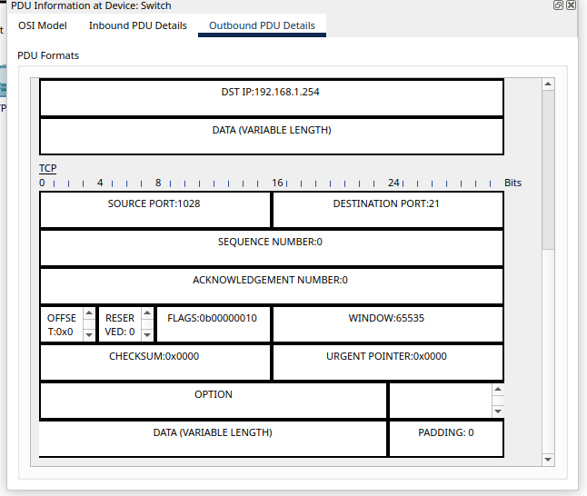

Question:
Are these communications considered to be reliable?

Si porque usa TCP, en la imagen se pueed notar.

d. Record the SRC PORT, DEST PORT, SEQUENCE NUM, and ACK NUM values.

En la imagen se observa, src port: 1028 (puede variar), dest port: 21 SEQUENCE NUM: 0 ACK NUM: 0

Question:
What is the value in the flag field?

SYN solamente

e. Close the PDU and click Capture/Forward until a PDU returns to the FTP Client with a checkmark.

f. Click the PDU envelope and select Inbound PDU Details.

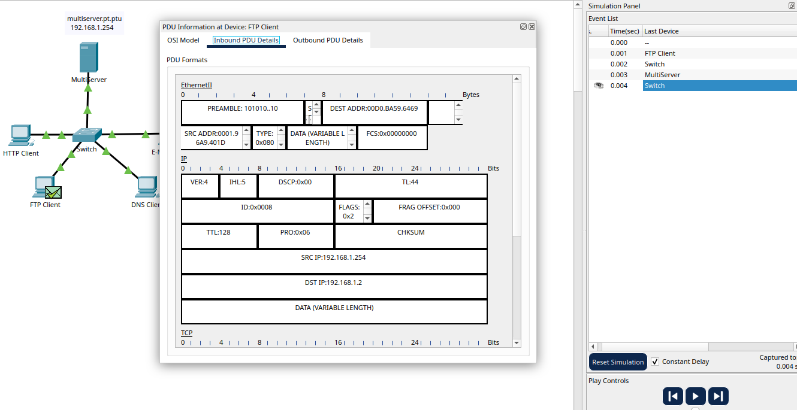

Question:
How are the port and sequence numbers different than before?

SRC 21, DEST 1028, SEQ 0, ACK 1. FLAGS SYN y ACK. Los puertos de origen y destino están invertidos, y ACK es 1.

g. Click the Outbound PDU Details tab.

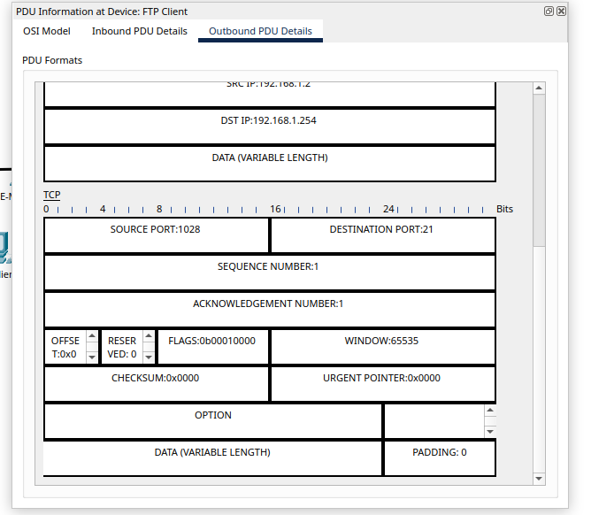

Question:
How are the port and sequence numbers different from the previous results?

Puertos invertidos dest 21 y src 1028, seq 1, ack 1 y la bandera es ACK

h. Close the PDU and click Capture/Forward until a second PDU returns to the FTP Client. The PDU is a different color.

i. Open the PDU and select Inbound PDU Details. Scroll down past the TCP section.

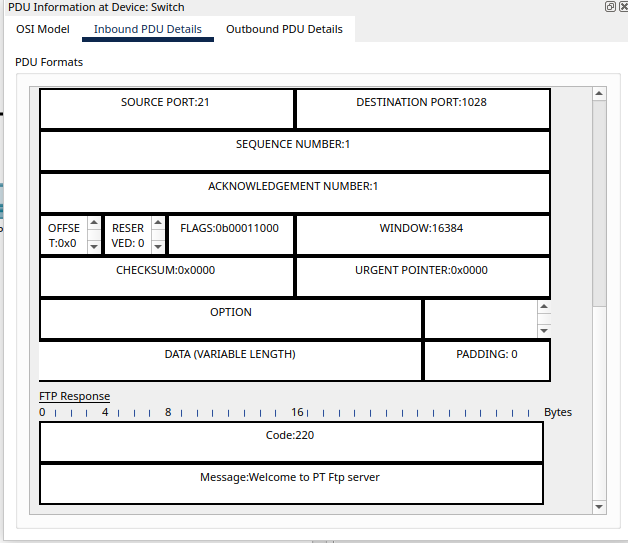

Question:
What is the message from the server?

En la imagen se ve que el mensaje es "Weltome to Ftp Server"

j. Click Reset Simulation.

### Step III

a. Repeat the steps in Part 1 to create DNS traffic.

No se van a colocar fotos en esta porque ya se hizo anteriormente.

b. In the Simulation Panel, change Edit Filters to display only DNS and UDP.

Tampoco se van a colocar imagenes ya que anteriormente se volvio a hacer

c. Click the PDU envelope to open it.

Es hacer click sobre el primer PDU, no hace falta adjuntar imagen, pero igualmente se pondra como evidencia.

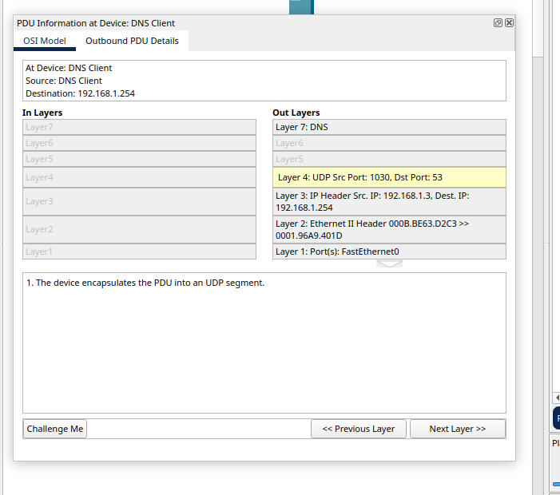

d. Look at the OSI Model details for the outbound PDU.

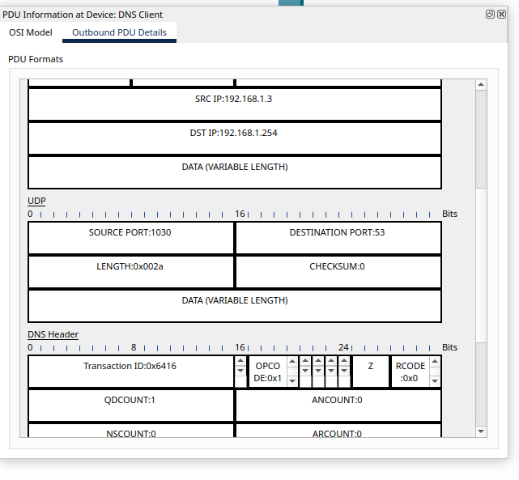

Question:
What is the Layer 4 protocol? UDP, este es el protocolo de capa 4 que se usa en este caso

Are these communications considered to be reliable? No, UDP no se considera un protocolo confiable, es como IP, no son protocolos confiables.

e. Open the Outbound PDU Details tab and find the UDP section of the PDU formats. Record the SRC PORT and DEST PORT values.

SRC PORT: 1030, DEST PORT: 53

Question:
Why are there no sequence and acknowledgement numbers? Porque el protocolo UDP no hace uso de numeros de secuencia ni de ACKs, por esto y otras razones no se considera un protocolo confiable.

f. Close the PDU and click Capture/Forward until a PDU with a check mark returns to the DNS Client.

g. Click the PDU envelope and select Inbound PDU Details.

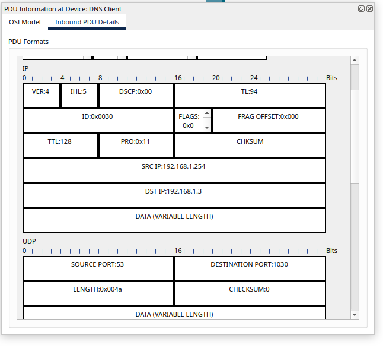

Question:
How are the port and sequence numbers different than before?

SRC PORT: 53 DEST PORT 1030, se encuentran invertidos.

What is the last section of the PDU called? What is the IP address for the name multiserver.pt.ptu?

La ultima seccion es DNS ANSWER y la IP de multiserver.pt.ptu es 192.168.254

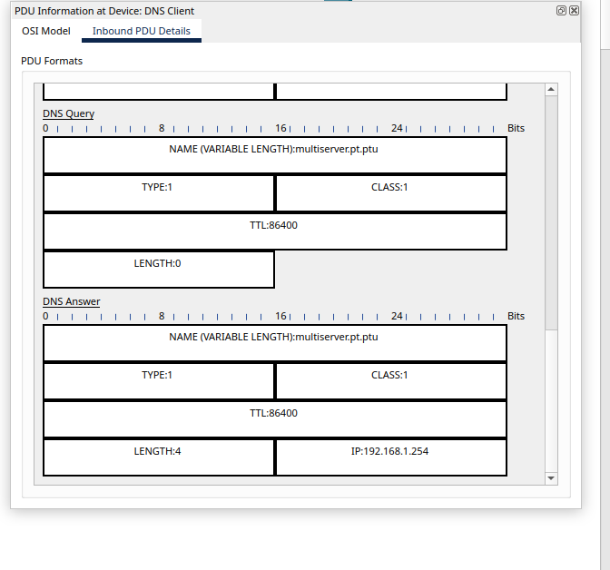

h. Click Reset Simulation.

### Step IV

a. Repeat the steps in Part 1 to send an email to user@multiserver.pt.ptu.

b. In the Simulation Panel, change Edit Filters to display only POP3, SMTP and TCP.

c. Click the first PDU envelope to open it.

d. Click the Outbound PDU Details tab and scroll down to the last section.

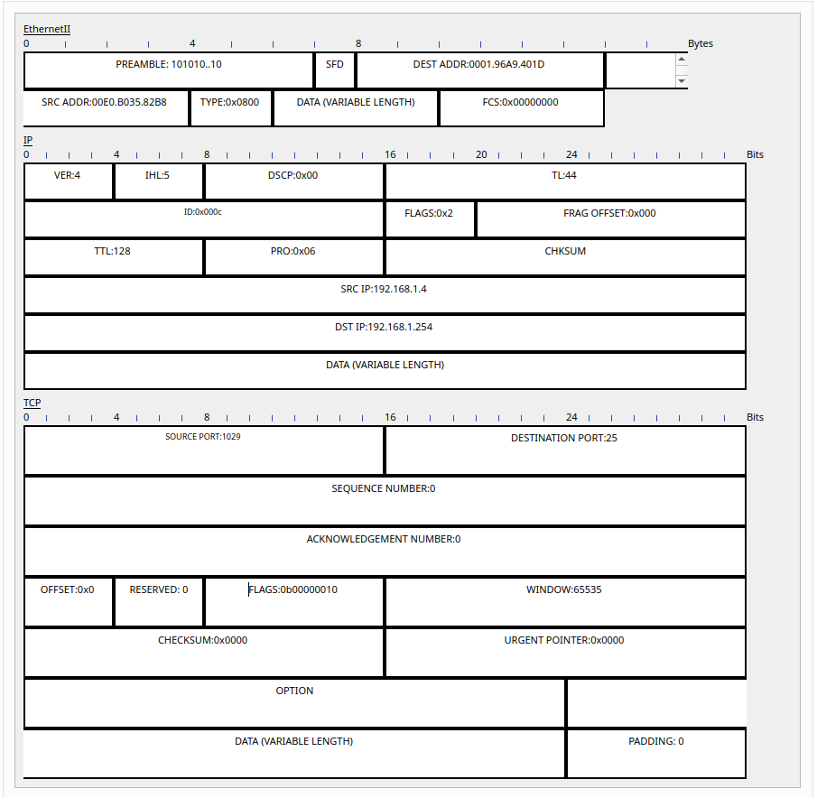a

Questions:
What transport layer protocol does email traffic use? Usa TCP, debido a que se necesita confiabilidad, seria fatal que el correo no llegue nunca!

Are these communications considered to be reliable? Si, TCP es un protocolo confiable

e. Record the SRC PORT, DEST PORT, SEQUENCE NUM, and ACK NUM values. What is the flag field value?

SRC PORT: 1029 (Este valor siempre puede variar), DEST PORT: 25 SEQUENCE NUM: 0 ACK NUM: 0, The flag is SYN

f. Close the PDU and click Capture/Forward until a PDU returns to the E-Mail Client with a checkmark.

g. Click the TCP PDU envelope and select Inbound PDU Details.

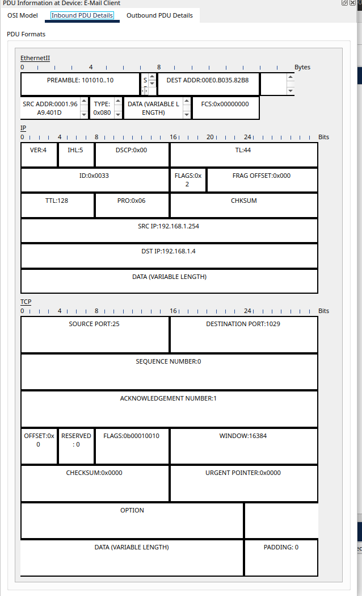

Question:
How are the port and sequence numbers different than before?

Estan invertidos SRC PORT: 25, DEST PORT: 1029, El numero de secuencia es 0 y el ACK cambia a 1, las banderas son SYN y ACK

h. Click the Outbound PDU Details tab.

Question:
How are the port and sequence numbers different from the previous two results?

i. There is a second PDU of a different color that E-Mail Client has prepared to send to MultiServer. This is the beginning of the email communication. Click this second PDU envelope and select Outbound PDU Details.

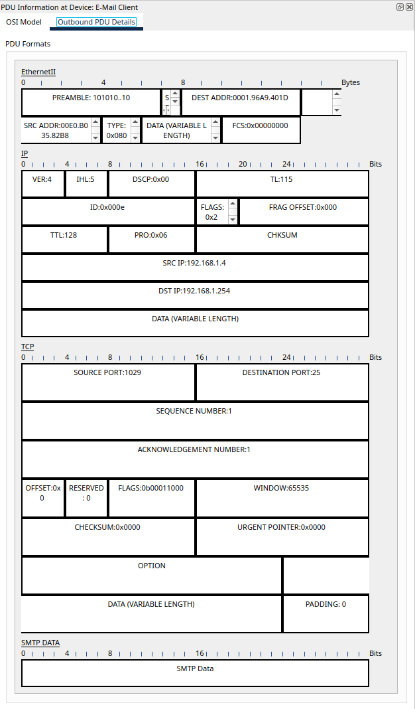

Questions:
How are the port and sequence numbers different from the previous two PDUs? nuevamente estan invertidos SRC: 1029 DEST: 25, El numero de secuencia es 1 y el ACK es 1, y las banderas son ACK Y PSH

What email protocol is associated with TCP port 25? What protocol is associated with TCP port 110? Asociado al puerto 25 es: SMTP y asociado al 110 es POP3

