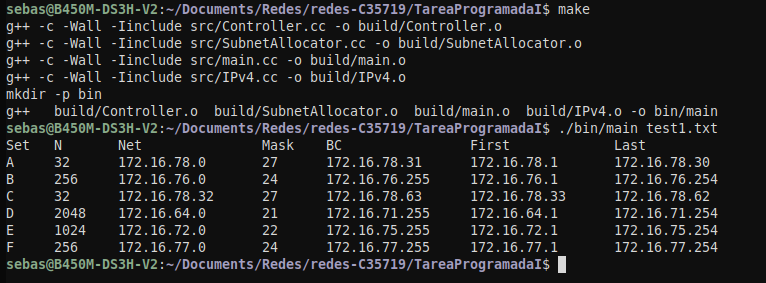
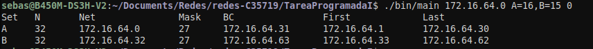
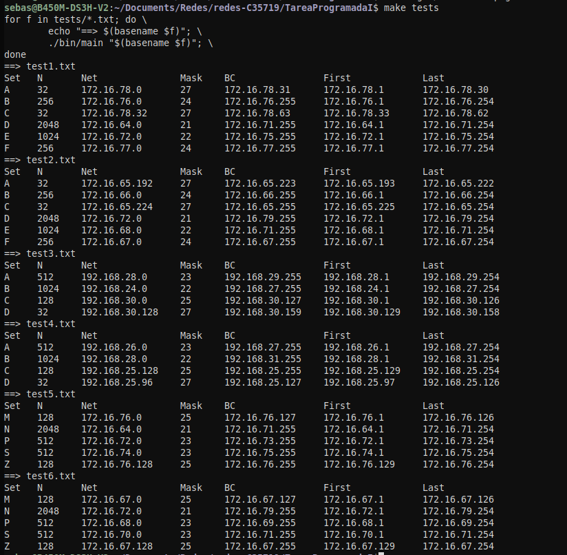

# Tarea Programada I

## Problema

Este programa realiza el subneteo de una red IPv4 base, repartiendo un conjunto de direcciones según un listado de solicitudes y el orden indicado (IP más grande al conjunto más grande o IP más pequeña al conjunto más grande). El usuario proporciona la IP base, las solicitudes y el orden de acomodo. El programa asigna a cada conjunto su nombre, cantidad de direcciones, dirección de red y máscara de red.

## Dependencias

- g++ (Fedora 41 o 42)
- make

## Ejecucion y Compilacion

Nota: Se asume que esta en un ambiente linux

### Compilación

``` bash
make

```

Para compilar con asan

``` bash

make asan

```

### Ejecución

Para ejecutar tiene dos opciones, el programa puede leer un archivo que se le envía por parámetro o puede enviar por parámetro una entrada (esta es una funcionalidad extra)

Para ejecutar un archivo de prueba

``` bash

./bin/main test1.txt

```

Para enviarle el caso por parámetro sin leer el archivo

``` bash

./bin/main 172.16.64.0 A=16,B=15 0

```

Nota: el último argumento indica si es de la IP más grande al conjunto más grande o la IP más pequeña al conjunto más pequeño un 1 para la IP más pequeña al conjunto más grande y un 0 para la IP más grande al conjunto más grande.

#### Funcionalidad extra para facilitar casos de prueba

El makefile proporcionado cuenta con la siguiente funcionalidad

``` bash

make tests

```

Esta opcion va a ejecutar todos los archivos.txt que se encuentran en la carpeta [tests](./tests)

## Ejemplos de uso e imagenes

En esta seccion principalmente se van a incluir imágenes, debido que en la sección de como ejecutar se dan dos ejemplos de como usar el programa.

### Compilación y Ejecucion por Archivo de Prueba



### Ejecución por parámetro del programa



### Ejecución por medio de la funcionalidad "make tests"



## Archivos de prueba

Para los archivos de prueba se necesita lo siguiente.

1. Que TODOS los archivos de prueba se ubiquen en el directrio [tests](./tests), sin subdirectorios.

2. Todos los archivos de prueba deben ser un .txt, puede ser otra extensión sin embargo, las pruebas en el programa se hicieron con .txt, no se recomienda otra extensión.

3. El formato a seguir es el siguiente:

    ``` txt
    172.16.64.0 A=16,B=127,C=30,D=1024,E=511,F=128 1
    <IP base> <NombreConjunto=CantidadRequeridaDeHosts> <1 para IP más pequeña al conjunto más grande>
                                                        <0 para IP más grande al conjunto más grande>
    ```

    Note que entre cada parámetro debe de haber un espacio, si no, puede conducir a resultados inesperados.

4. Los nombres de los conjuntos deben de ser caracteres no cadenas, se recomienda usar letras, esto se hizo así para mantener convención con los ejemplos de las presentaciones.

5. Los conjuntos deben de ir siempre de la siguiente manera <Nombre=Número>, estos deben estar pegados sin espacios, posteoriormente un coma y el siguiente nombre, si no se va a poner siguiente un espacio y el número indicando como ordenar. No se recomienda poner un número diferente a 1 o 0, si se pone otro, probablemente ocurra lo mismo con un 1, pero no se recmienda.

6. Ver los casos de pruebas para más ejemplos.
